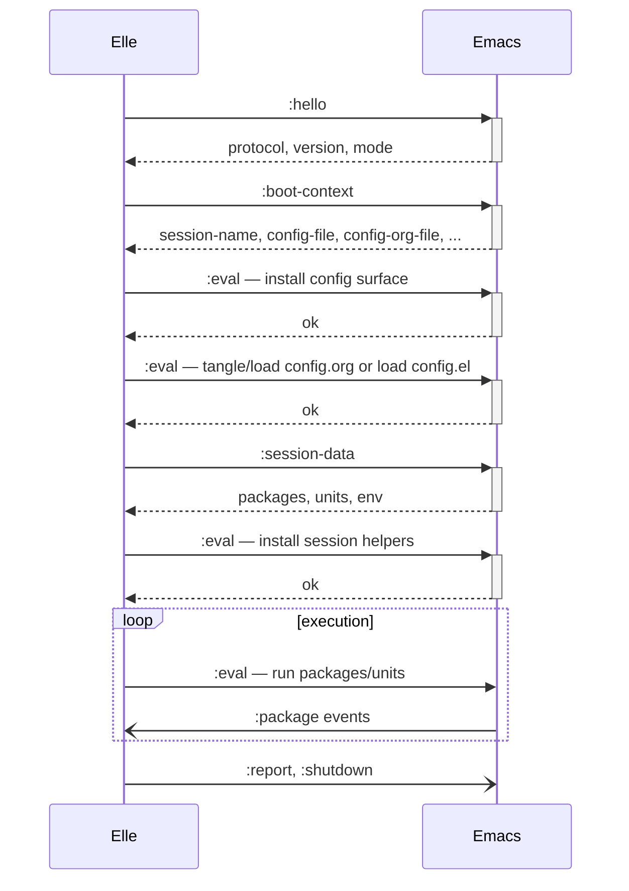

# sexp-rpc Protocol

Emacs Hypervisor uses a Lisp-native RPC/event protocol called sexp-rpc. It is
JSON-RPC-shaped in semantics (request/response correlation, async events,
versioned envelope) but uses S-expressions as the wire format, preserving the
Lisp-to-Lisp properties the project needs:

- Emacs parses incoming values with `read`.
- Elle constructs messages with quasiquote/unquote.
- Payloads stay native Lisp data instead of becoming JSON objects.
- Code-as-data remains available where the trusted `:eval` surface is needed.

## Transport

- **Stdio** between Emacs and the `emacs-hypervisor` subprocess.
- **One message per line** --- newline is the frame boundary.
- **Strings are escaped** during serialization (`print-escape-newlines`,
  `print-escape-control-characters`) so embedded newlines never break framing.
- The Emacs process filter buffers partial chunks and uses incremental `read`,
  not a blocking loop that assumes whole messages arrive at once.

## Envelope

Every message is a top-level `:rpc` plist:

```lisp
(:rpc :protocol :sexp-rpc :version 1 :kind <kind> ...)
```

### Request (Elle to Emacs)

```lisp
(:rpc :protocol :sexp-rpc :version 1
 :kind :request
 :id 3
 :op :session-data
 :payload (:fields (:packages :units :env)))
```

### Response (Emacs to Elle)

Success:

```lisp
(:rpc :protocol :sexp-rpc :version 1
 :kind :response
 :id 3
 :ok t
 :payload (:packages (...) :units (...) :env (...)))
```

Failure:

```lisp
(:rpc :protocol :sexp-rpc :version 1
 :kind :response
 :id 4
 :ok nil
 :error "(error \"...\")")
```

### Event (Elle to Emacs, or Emacs to Elle for `:package`)

```lisp
(:rpc :protocol :sexp-rpc :version 1
 :kind :event
 :topic :report
 :payload (:stage :executed :phase :units :items (...)))
```

## Operations

| Op | Purpose |
|---|---|
| `:hello` | Handshake; Emacs responds with protocol, version, mode, transport |
| `:boot-context` | Emacs responds with session-level facts |
| `:session-data` | Emacs responds with exported packages, units, env |
| `:eval` | Emacs evaluates a form from `:payload :form` |

## Event Topics

| Topic | Source | Purpose |
|---|---|---|
| `:plan` | Elle | Execution plans for packages and units |
| `:progress` | Elle | Step-by-step progress updates during startup |
| `:log` | Elle | Informational log messages |
| `:report` | Elle | Planned and executed report items |
| `:metric` | Elle | Benchmark timing data (when enabled) |
| `:package` | Emacs | Elpaca package install/finish/timeout events |
| `:shutdown` | Elle | Session finished, with reason and optional failure status |

### Package event payloads

Emitted by the Elpaca bridge on the Emacs side, consumed by Elle:

```lisp
(:phase :packages :kind :installed :name "magit")
(:phase :packages :kind :finished)              ;; :reason is optional
(:phase :packages :kind :timeout)               ;; :reason is optional
```

## Handshake



Config load failures are reported as graceful failed shutdowns instead of Elle
runtime crashes:

```lisp
(:rpc :protocol :sexp-rpc :version 1 :kind :event :topic :log
 :payload (:level :error :phase :startup :step :load-config
           :source "/path/to/config.org"
           :message "config load failed for /path/to/config.org: ..."
           :details "...full Emacs error and backtrace..."))

(:rpc :protocol :sexp-rpc :version 1 :kind :event :topic :shutdown
 :payload (:reason :config-load-failed :status :failed
           :phase :startup :step :load-config
           :source "/path/to/config.org"))
```

### Boot-context response fields

| Field | Purpose |
|---|---|
| `:session-name` | Session identifier |
| `:config-file` | Path to fallback plain `config.el`, after Emacs-side config directory resolution |
| `:config-org-file` | Path to `config.org`, when present, after Emacs-side config directory resolution |
| `:repo-dir` | Emacs home directory |
| `:ui` | `batch` or `interactive` |
| `:transport` | `s-expression` |
| `:benchmark-enabled` | Whether to emit `:metric` events |

## Mailbox

sexp-rpc is request/response correlated by `:id`, but the transport is one
shared async stream. Elle cannot discard unrelated messages while waiting for a
specific response or event.

The protocol helpers keep an in-memory mailbox that routes incoming messages by
`(:response id)` or `(:event topic)`. If a message does not satisfy the current
waiter, it is buffered and retried by later waits instead of being dropped.
This avoids ordering bugs where package events or eval responses arrive while
another waiter is active.

## Failure Payloads

Reports are the source of truth for execution outcomes. Each report item has
`:name`, `:status`, `:reason`, and `:details`.

### Status

| Status | Meaning |
|---|---|
| `:ok` | Succeeded |
| `:skipped` | Skipped due to upstream failure |
| `:failed` | Execution failed |
| `:invalid` | Structurally invalid (missing deps, cycles, preflight) |

### Reason

| Reason | Used for |
|---|---|
| `:executed` | Successfully executed |
| `:queued` | Package queued to Elpaca |
| `:blocked-by-package` | Upstream package failed |
| `:blocked-by-unit` | Upstream unit failed |
| `:missing-deps` | Package has unresolved `:deps` |
| `:missing-required-packages` | Unit has unresolved `:requires` |
| `:missing-after-units` | Unit has unresolved `:after` |
| `:cycle` | Part of a dependency cycle |
| `:preflight` | Failed env or executable check |
| `:execution` | Eval or runtime error |

### Detail shapes

```lisp
;; missing references (packages or units)
(:missing (...))

;; dependency blockers
(:blockers (...))

;; cycle members
(:members (...))

;; preflight failures
(:env (...) :executable (...))

;; eval failures
(:source :eval :error "...")

;; tracker failures
(:source :tracker :error :timeout)
(:source :tracker :error :missing-install-callback)
(:source :tracker :error :missing-install-callback :finished-reason "...")

;; queue failures
(:source :queue :error "...")
```
