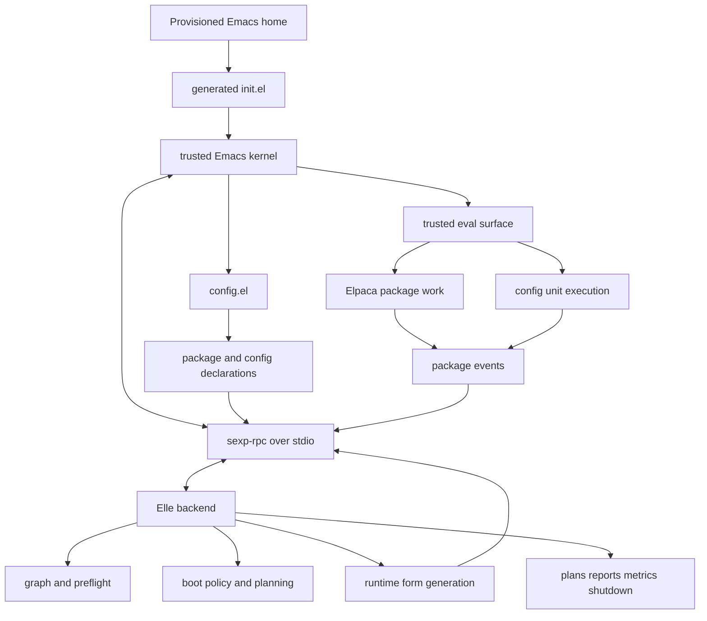

# Emacs Hypervisor

`emacs-hypervisor` is an Elle-native external control plane for Emacs
configuration. Emacs stays a small trusted Lisp evaluation kernel; Elle owns
graph resolution, boot policy, orchestration, and runtime code generation.

**Attention Conservation Notice**

For: Contributors working on startup, protocol, runtime forms, or config units

What: Current architecture and file ownership for the Lisp-to-Lisp runtime path

Action: Read this before changing the kernel boundary or Elle orchestration

Skip if: You only need command syntax; see `NATIVE-HOST.md` instead

## Current Status

The core Lisp-to-Lisp path is now in place.

Config units are exported from Emacs as structured Lisp forms, sent over
`sexp-rpc` as S-expressions, preserved as raw code data inside Elle session
data, and sent back to Emacs as quoted forms for evaluation. This removes the
old string-read execution path while keeping protocol metadata available as
ordinary Elle data.

The project is still in spike/productization mode. The architecture is stable
enough to treat the README as the canonical target, but runtime helpers are
still being simplified.

## Architecture



## Runtime Split

The resident Emacs side is intentionally small:

- generated `init.el`
- trusted bootstrap kernel under `host/templates/lisp/`
- `sexp-rpc` process filter, request dispatch, and session state
- declaration/export surface for `package!` and `config-unit!`
- trusted `:eval` surface for Elle-emitted forms

Elle owns the behavior that should not live permanently in Emacs:

- protocol mailboxing and request correlation
- package graph and config-unit graph handling
- preflight checks
- boot policy
- package and unit planning
- execution ordering
- failure propagation
- report derivation
- runtime Elisp form generation

The emitted runtime forms under `elle/runtime-forms/` are the execution
substrate. They may install Elpaca bridges, report helpers, and unit execution
helpers into the live Emacs session, but they should not become a second
resident policy engine.

## Lisp-To-Lisp Boundary

The important invariant is that protocol data and code data are decoded with
different rules.

Protocol metadata is decoded into normal Elle data so graph and planning code
can work with structs, lists, arrays, strings, and keywords.

Config-unit bodies remain Lisp code data. Elle must not recursively convert
plist-like lists inside `:body`, because Elisp forms such as
`(foo (:a 1 :b 2))` are code/data and not protocol plists.

The current path is:

1. `config-unit!` captures the body as `(progn ... t)`.
2. Emacs canonicalizes reader-hostile forms while preserving semantics.
3. Emacs sends session data through `sexp-rpc`.
4. Elle decodes package/unit/env metadata, preserving each unit `:body` raw.
5. Elle emits `(emacs-hypervisor-runtime-run-unit NAME 'BODY 'REQUIRES)`.
6. Emacs evaluates the structured body directly.

This is the Lisp-to-Lisp homoiconic surface that unlocks later advanced
features such as structural inspection, targeted rewrites, interactive
remediation, and live reload without re-parsing opaque strings.

## Startup Flow

1. A provisioned Emacs home loads generated `init.el`.
2. `init.el` loads the trusted kernel and starts the native host subprocess.
3. Elle sends `:hello` and `:boot-context`.
4. Emacs loads `config.el`, collecting declarations.
5. Elle requests `:session-data` for packages, units, and env.
6. Elle derives package and config-unit plans.
7. Elle installs transient runtime helper forms into Emacs.
8. Elle queues package work and tracks package events.
9. Elle executes runnable config units in dependency order.
10. Elle sends plan, progress, report, metric, and shutdown events.

## File Guide

- `config.el` is the repo test configuration source.
- `host/templates/lisp/` contains install-time trusted kernel templates.
- `host/templates/init.el` is the generated-home startup template.
- `elle/hypervisor.lisp` is the shared backend entrypoint.
- `elle/protocol.lisp` contains `sexp-rpc` helpers and wire decoding.
- `elle/graph.lisp`, `elle/preflight.lisp`, `elle/boot-policy.lisp`,
  `elle/planning.lisp`, and `elle/execution.lisp` own orchestration policy.
- `elle/runtime-forms.lisp` coordinates emitted runtime modules.
- `elle/runtime-forms/` contains transient Emacs helper modules.
- `tests/elle/hypervisor-runtime.lisp` covers shared Elle runtime semantics.
- `tests/elisp/emacs-hypervisor-bootstrap-test.el` covers the trusted kernel
  and runtime helper behavior.

## Developer Commands

```bash
just test
just analyze-runtime
just build
just live-test /tmp/test3
```

Use `just analyze-runtime` after changes to shared Elle modules. Use a
provisioned Emacs home for live startup tests.

## Related Docs

- `PROTOCOL.md` documents `sexp-rpc` message shape and failure payloads.
- `NATIVE-HOST.md` documents normal host binary usage.
- `host/README.md` documents generated-home bootstrap rules.
- `host/ELISP-PACK.md` documents the static Elisp packing boundary.
- `PROJECT-LOG.md` is historical implementation context, not the current
  architecture contract.
- `AGENTS.md` is the agent workflow guide for this repository.
