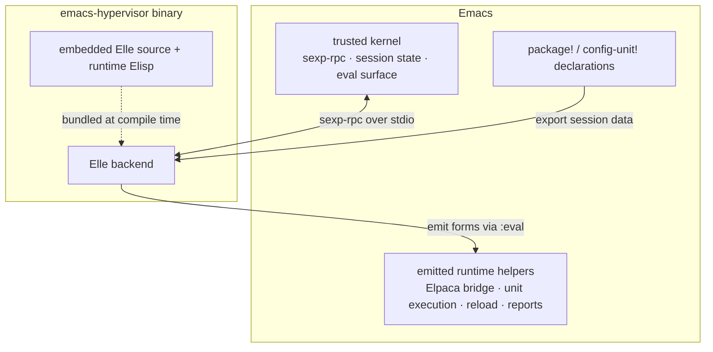
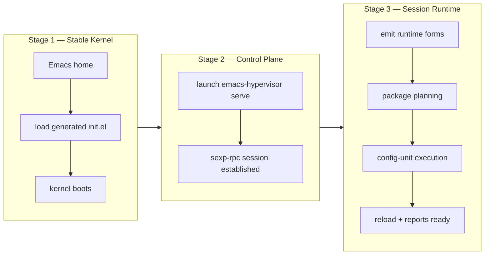

# Emacs Hypervisor

A single native binary, written in [Elle](https://github.com/elle-lisp/elle)
(a modern Lisp over Rust), for deterministic, reloadable Emacs configuration.

Hypervisor is a small foundation for building your own config, not an Emacs
distribution. You keep ownership of `config.org` (or `config.el`); Hypervisor
provides the package declarations, config-unit declarations, dependency
planning, reload support, and a Lisp-native control plane around Emacs.

Today, Hypervisor tackles two sources of unpredictability in real-world Emacs
configs:

**Deterministic startup.** Most Emacs configs are order-sensitive scripts where
package installation, feature loading, and configuration blur together. A
missing dependency or misordered `require` becomes an intermittent bug that
surfaces hours later, hidden behind lazy loading, with no context about what
went wrong.

Hypervisor treats your config as a **dependency graph**. It resolves packages
and config units with topological sorting, runs preflight checks, and surfaces
every failure in the first five seconds --- not two hours later.

**Dead effect cleanup.** Re-evaluating Elisp is easy; undoing what the old
version did is not. A normal reload leaves duplicate hook entries, stale advice,
stale keybindings, and orphaned anonymous functions. After enough reloads, the
live session no longer matches the file you edited.

Hypervisor currently tracks `add-hook`, `advice-add`, and common keybinding
forms as runtime effect records. On reload, it retracts the previous effects
before applying the new version. This is the killer feature for daily editing in
long-lived sessions.

## User-Facing Model

The entire user-facing surface is two macros:

| Macro | Purpose |
|---|---|
| `package!` | Declare packages and their dependencies |
| `config-unit!` | Declare named blocks of configuration |

This gives you a bare framework for organizing your own configuration. It does
not choose your packages, keybindings, UI, editing model, or workflow.

## Features

- **Single binary** --- drop one executable on your `PATH`; no Rust toolchain,
  no framework repo to clone, no external runtime.
- **Generated bootstrap** --- a small trusted kernel in the Emacs home; your
  config lives separately and is never overwritten.
- **Literate config** --- write `config.org` and Hypervisor auto-tangles it at
  startup and reload; no manual tangle step needed.
- **Elpaca-backed packages** --- `package!` declarations feed into Elpaca for
  async, reproducible installation.
- **Topological sorting** --- packages and config units resolve in deterministic
  order, eliminating the class of bugs caused by load-order sensitivity.
- **Preflight checks** --- missing packages, circular dependencies, unset env
  vars, missing executables, and absent features are caught *before* execution
  begins.
- **Eager, fail-fast startup** --- surface errors in the first five seconds
  instead of hiding them behind lazy loading for hours.
- **Selective reload** --- edit one unit and apply only what changed, without
  replaying the entire config.
- **Effect-aware reload** --- automatically clean old hooks, advice, and
  keybindings before re-applying a changed unit, preventing the stale-state
  drift that plagues long-lived sessions.
- **Startup reports** --- progress events, package events, status inspection,
  and optional metrics give you full visibility into what happened and why.

## Why Eager Startup

Lazy loading is the default tradeoff in most Emacs configs: defer everything
to make startup fast, and hope nothing is broken. The cost is that errors
surface hours into a session --- in the middle of real work, with no context
about what went wrong.

Hypervisor takes the opposite tradeoff: resolve the entire dependency graph,
run config units in deterministic order, and prove the config is internally
consistent at startup. If something is broken, you know immediately.

Eager does not mean force-loading every package. `:requires` should be used
only when the body truly needs a feature loaded first (package-local variables,
keymaps, macros, non-autoloaded functions). Hook registration, global
keybindings, autoloaded commands, and pre-load-safe variable setup can all run
eagerly without `:requires`.

## Reload

### Selective Reload

`M-x emacs-hypervisor-reload-config` reloads `config.org`, when present, or
`config.el` in a running session. It diffs the previous declarations against
the new ones:

- **Unchanged** units are skipped.
- **New** and **changed** units are applied.
- **Removed** units are not evaluated again.

Edit one unit without replaying every package integration, mode setup, hook
registration, and keybinding in your session.

Reload emits a short transcript in `*Messages*` so effect-aware cleanup is
visible while it happens:

```text
[Hypervisor] Reload started
[Hypervisor] Reload cleaned hook prog-mode-hook -> display-line-numbers-mode for project-hooks
[Hypervisor] Reload cleaned keybinding global-map C-c e -> eval-expression for editing-keys
[Hypervisor] Reload re-applied unit: project-hooks
[Hypervisor] Reload: 1 changed applied, 12 unchanged skipped, 2 old effects cleaned.
```

### Effect-Aware Reload

The killer feature is not that Hypervisor can re-evaluate config. Emacs can
already do that. The hard problem is that Emacs config is full of mutation:
`add-hook` appends to hook variables, `advice-add` changes function behavior,
keybinding forms mutate keymaps, and anonymous functions create fresh objects
every time they are evaluated. A normal reload is additive. Fix a hook body and
the old one may still be there. Move advice from one target to another and both
versions may keep running. Delete a keybinding and it may survive until restart.
After enough reloads, the live Emacs session no longer matches the file you are
editing.

Effect-aware reload makes supported config effects explicit runtime records.
Because config-unit bodies remain structured Lisp data, Hypervisor can walk the
executable body positions and route recognized hooks, advice, and keybinding
calls through an effect registry. The registry performs the real Emacs
operation, then records what actually happened: the owning unit, effect kind,
concrete target, installed function or definition, apply form, retract form, and
metadata.

On the next reload, changed and removed units are handled in two phases:

1. Retract the previous active effect records for that unit.
2. Apply the new unit body, recording its new effects.

```elisp
(config-unit! project-hooks
  :config
  (add-hook 'prog-mode-hook #'display-line-numbers-mode))

(config-unit! save-behavior
  :config
  (advice-add 'save-buffer :before #'delete-trailing-whitespace))

(config-unit! text-editing
  :config
  (add-hook 'text-mode-hook
            (lambda () (setq-local fill-column 80))))

(config-unit! editing-keys
  :config
  (keymap-set global-map "C-c e" #'eval-expression))

(config-unit! editing-hooks
  :config
  (dolist (hook '(text-mode-hook prog-mode-hook))
    (add-hook hook
              (lambda () (setq-local fill-column 80)))))
```

Symbol functions and anonymous functions use the same path. If a function value
cannot be removed by stable identity, the registry installs it through an owned
symbol and records that symbol in the retract form. Loops work for the same
reason: each iteration records the concrete hook, advice, or keybinding target
that was actually installed, so cleanup does not have to guess from the new
source.
Keybindings do not stack, so cleanup focuses on stale bindings: if the live
binding still matches the definition Hypervisor installed, cleanup unsets it.
If the binding changed outside Hypervisor, cleanup skips it.

The recognizer is intentionally conservative. It currently tracks global
`add-hook`, `advice-add`, and supported keybinding effects in executed body
positions, including `progn`, `let`, `let*`, `when`, `unless`, `if`, `cond`,
`dolist`, and `dotimes`.
It does not rewrite quoted data, function literals, lambda bodies, function
definitions, or unknown macro/helper-call bodies. Local hook registrations with
a non-nil `LOCAL` argument are not tracked yet. Variables, timers, faces, and
other side effects are left untracked and are not reset unsafely.

The registry is described in [docs/effect-registry.md](docs/effect-registry.md).

## Literate Config (config.org)

Hypervisor supports literate configuration via Org-mode. Place a `config.org`
in the Hypervisor config directory instead of `config.el`, and Hypervisor will
automatically tangle it before loading. No manual tangle step is required.

The Hypervisor config directory is `$XDG_CONFIG_HOME/emacs-hypervisor` when
`XDG_CONFIG_HOME` is set, otherwise `$HOME/.config/emacs-hypervisor`.

```org
* Magit

#+begin_src emacs-lisp
(package! magit)
(config-unit! magit-ui
  :requires (magit)
  :executable (git)
  :config
  (keymap-set global-map "C-x g" #'magit-status))
#+end_src
```

When `config.org` is present, `config.el` is not needed. Hypervisor
automatically tangles all `elisp` and `emacs-lisp` source blocks into a hidden
`.config.tangled.el` and loads that. No `:tangle` header is required on your
blocks. Blocks with `:tangle no` are still respected and skipped.

If both `config.org` and `config.el` exist, Hypervisor uses `config.org` and
warns that `config.el` is ignored.

`M-x emacs-hypervisor-reload-config` also tangles `config.org` before reloading,
so edits to the Org file take effect immediately.

Tangling uses Emacs's built-in `org-babel-tangle-file` with a language filter
for `elisp` and `emacs-lisp`. The typical overhead is under 200ms for a
2000-line config.

## Config Example

```elisp
(package! magit)
(package! transient
  :repo "magit/transient"
  :branch "main")

(config-unit! magit-ui
  :requires (magit)
  :executable (git)
  :config
  (keymap-set global-map "C-x g" #'magit-status))

(config-unit! project-hooks
  :after (magit-ui)
  :config
  (add-hook 'magit-mode-hook
            (lambda ()
              (setq-local truncate-lines t))))
```

`magit-ui` requires the `magit` feature before it runs. `project-hooks` only
needs `magit-ui` to have completed first; its hook registration can run eagerly
without loading another package feature.

## Usage

Download the `emacs-hypervisor` binary for your platform, make it executable,
and place it somewhere on `PATH`.

```bash
mkdir -p ~/.local/bin
chmod +x emacs-hypervisor
mv emacs-hypervisor ~/.local/bin/emacs-hypervisor
```

Initialize an Emacs home:

```bash
emacs-hypervisor init --home ~/.config/emacs
```

`init` refuses to initialize a non-empty home. This is deliberate: the generated
`init.el` is a managed bootstrap artifact, while your configuration belongs in
the Hypervisor config directory.

After upgrading or reinstalling the binary, refresh an existing generated home:

```bash
emacs-hypervisor init --home ~/.config/emacs --upgrade
```

`init --upgrade` only rewrites files that were generated by Emacs Hypervisor. It
refuses to overwrite unmanaged `init.el` or `early-init.el` files. Generated
`init.el` files include a content hash; startup compares that hash with the
currently resolved binary and records a report warning when the bootstrap is
stale.

Create or edit your config. Use either a literate Org file or a plain Elisp
file:

```text
~/.config/emacs-hypervisor/config.org     # literate config (recommended)
~/.config/emacs-hypervisor/config.el      # or plain Elisp
~/.config/emacs-hypervisor/early-init.el  # optional bootstrap customization
```

Optionally capture the current shell environment for Emacs:

```bash
emacs-hypervisor env --home ~/.config/emacs
```

`env` writes a Lisp list of `"KEY=VALUE"` strings. The generated startup loads
that file before user config, updates `process-environment`, and rebuilds
`exec-path` from `PATH`. It intentionally leaves `shell-file-name` to user
config.

Start Emacs:

```bash
emacs --init-directory ~/.config/emacs
```

If GUI Emacs cannot see your shell `PATH`, or if you want to test a specific
binary, launch Emacs with `EMACS_HYPERVISOR_BIN`:

```bash
EMACS_HYPERVISOR_BIN=/path/to/emacs-hypervisor \
  emacs --init-directory ~/.config/emacs
```

`EMACS_HYPERVISOR_BIN` is an absolute or relative path to the host binary the
generated `init.el` should launch. It wins over `PATH` lookup and is useful for
temporary testing, GUI launches, and installations where the binary is not in
Emacs's inherited environment.

## Subcommands

| Command | Purpose |
|---|---|
| `emacs-hypervisor` | Start the stdio backend (alias for `serve`) |
| `emacs-hypervisor serve` | Start the stdio backend explicitly |
| `emacs-hypervisor init [--home DIR] [--upgrade]` | Write or refresh generated bootstrap files in an Emacs home |
| `emacs-hypervisor env [--home DIR] [-o FILE]` | Write a shell environment snapshot |

Default Emacs home: `$XDG_CONFIG_HOME/emacs` if set, otherwise
`$HOME/.config/emacs`.

Default Hypervisor config directory: `$XDG_CONFIG_HOME/emacs-hypervisor` if
set, otherwise `$HOME/.config/emacs-hypervisor`.

## Generated Home Layout

Do not edit generated files in the Emacs home. The generated `early-init.el`
loads the user-owned `early-init.el` from the Hypervisor config directory when
that file exists.

```text
~/.config/emacs/
├── init.el        # generated, managed by Hypervisor
├── early-init.el  # generated proxy to Hypervisor config early-init.el
└── env            # optional, generated by `emacs-hypervisor env`
```

```text
~/.config/emacs-hypervisor/
├── early-init.el  # optional, user-owned startup customization
├── config.org     # literate config (preferred, auto-tangled)
└── config.el      # plain config fallback
```

## Reference

### `package!` options

| Option | Purpose |
|---|---|
| `:repo` | Git repository (e.g. `"magit/transient"`) |
| `:host` | Git host (`"github"`, `"gitlab"`, etc.) |
| `:branch` | Branch to track |
| `:tag` | Tag to pin |
| `:ref` | Exact ref to pin |
| `:files` | File patterns to include |
| `:deps` | Package dependencies |
| `:local` | Local filesystem path |
| `:no-compilation` | Skip native compilation |

### `config-unit!` options

| Option | Purpose |
|---|---|
| `:after` | Run this unit only after the named units have completed |
| `:requires` | Load these package features before running the body |
| `:env` | Skip this unit if any of these environment variables are unset |
| `:executable` | Skip this unit if any of these binaries are missing from `PATH` |
| `:config` | The configuration body |

### Elisp bootstrap variables

Set these in the Hypervisor config `early-init.el` before the generated
`init.el` runs.

| Variable | Default | Purpose |
|---|---|---|
| `emacs-hypervisor-config-file` | `config.el` in Hypervisor config directory | Plain config file to load when `config.org` is absent |
| `emacs-hypervisor-config-org-file` | `config.org` in Hypervisor config directory | Literate config file to tangle and load when present |
| `emacs-hypervisor-env-file` | `env` in Emacs home | Env snapshot file (or `EMACS_HYPERVISOR_ENV_FILE`) |
| `emacs-hypervisor-binary-name` | `"emacs-hypervisor"` | Binary name for `PATH` lookup |
| `emacs-hypervisor-open-buffer-on-abnormal-exit` | `t` | Show process buffer on abnormal exit |

### Runtime variables

Set these in your `config.org` or `config.el`. They take effect during the
startup session.

| Variable | Default | Purpose |
|---|---|---|
| `emacs-hypervisor-show-report-on-startup` | `nil` | When non-nil, display the startup report after package processing finishes, or at the first config-unit when there is no package work. The report always appears when a config-unit fails, regardless of this setting. |
| `emacs-hypervisor-display-initial-buffer-on-finish` | `t` | When the startup report is hidden, display `initial-buffer-choice` after a clean startup and bury Elpaca's startup log if it was shown. |

## How It Works

Hypervisor is written in [Elle](https://github.com/elle-lisp/elle), a modern
Lisp over Rust, and compiles to a single native binary with orchestration logic,
Elle source, and runtime Elisp embedded. No external runtime, no framework repo
to clone --- just drop the binary on your `PATH`.

At startup, Emacs loads a tiny generated kernel that launches the Hypervisor
binary over stdio. From there, Hypervisor takes over: it reads your
declarations, builds the dependency graph, runs preflight checks, and feeds
Emacs the exact ordered commands to install packages and execute config units.

Three properties make this architecture distinctive:

**Deterministic startup as a dependency graph.** Hypervisor grew out of
[`emacs-backbone`](https://github.com/nohzafk/emacs-backbone), which proved
that topological sorting and explicit dependencies eliminate non-determinism in
Emacs config. Hypervisor takes the idea further: startup becomes an observable
orchestration session with preflight validation, failure propagation, execution
plans, and reports.

**Lisp-to-Lisp homoiconicity.** Because Elle is a Lisp, config-unit bodies
travel between Hypervisor and Emacs as structured Lisp data, not opaque strings.
Hypervisor can inspect those Elisp forms and route supported effect sites
through semantically equivalent runtime operations. This is what powers
effect-aware reload: supported hooks, advice, and keybinding calls are
rewritten into effect-registry operations, then the registry's concrete runtime
records are used to retract old effects before re-applying a unit --- all
without string parsing.

**Single binary, zero framework overhead.** Traditional Emacs config frameworks
require cloning a repo into `~/.config/emacs` because Emacs must load an
`init.el` written in Elisp. Hypervisor compiles everything into one binary. Your
Emacs home contains only generated bootstrap files; your own config lives
cleanly in the Hypervisor config directory.

## Architecture

One rule: **Emacs keeps a small trusted kernel; Elle owns orchestration
policy.**



| Layer | Lifetime | Owns |
|---|---|---|
| **Emacs kernel** | Resident, small | Process startup, session state, sexp-rpc dispatch, `package!` / `config-unit!` macros, trusted `:eval` surface |
| **Elle backend** | Runs in binary | Dependency graphs, preflight checks, boot policy, execution ordering, failure propagation, reports |
| **Runtime forms** | Transient, per session | Elpaca bridge, unit execution, reload, report rendering --- execution substrate, not a second policy engine |

### Three-Stage Bootstrap



**Stage 1 --- Stable kernel.** The generated `init.el` contains the trusted
Emacs kernel: process startup, session state, sexp-rpc parsing, request
dispatch, and the small eval surface used by the host.

**Stage 2 --- Control plane.** Emacs launches `emacs-hypervisor serve`, then
Emacs and Elle exchange request, response, and event messages over stdio using
S-expressions.

**Stage 3 --- Session runtime.** The binary embeds Elle source and runtime
Elisp forms; Elle sends them into Emacs for the current session, then runs
package planning, config-unit execution, reload support, reports, and shutdown.

### Lisp-to-Lisp Data Flow

The key invariant: **protocol metadata and code data are decoded with different
rules.** Protocol fields become normal Elle data for graph and planning code.
Config-unit `:body` fields remain raw Lisp code --- Elle never recursively
converts plist-like lists inside a body, because `(foo (:a 1 :b 2))` is
code/data, not a protocol plist.

The path through the system:

1. `config-unit!` captures the body as `(progn ... t)`.
2. Emacs canonicalizes reader-hostile forms while preserving semantics.
3. Supported hook, advice, and keybinding sites are normalized into
   effect-registry helper calls.
4. Emacs sends session data through sexp-rpc.
5. Elle decodes package, unit, and env metadata; each unit `:body` stays raw
   Lisp code rather than becoming protocol data.
6. Elle emits `(emacs-hypervisor-runtime-run-unit NAME 'BODY 'REQUIRES)`.
7. Emacs evaluates the structured body directly; registry helpers install and
   record supported runtime effects.

This homoiconic surface is what makes structural inspection, targeted rewrites,
effect-aware reload, and interactive remediation practical without re-parsing
opaque strings.

## File Guide

```text
emacs-hypervisor/
├── host/                              # Rust native host
│   ├── src/main.rs                    # CLI entrypoint (init, env, serve)
│   ├── build.rs                       # embeds Elle source + Elisp at compile time
│   ├── emacs-kernel/                  # trusted Emacs kernel (bundled into init.el)
│   │   ├── home-startup.el            #   home bootstrap wrapper
│   │   ├── emacs-hypervisor-bootstrap.el    #   process startup, sexp-rpc, eval surface
│   │   ├── emacs-hypervisor-session-state.el#   session state management
│   │   └── emacs-hypervisor-sexp-rpc.el     #   S-expression wire protocol
│   └── elisp_pack/                    # build-time Elisp packer (Rust crate)
│       └── src/lib.rs
│
├── elle/                              # Elle backend (embedded in binary)
│   ├── hypervisor.lisp                # backend entrypoint
│   ├── protocol.lisp                  # sexp-rpc helpers, wire decoding
│   ├── graph.lisp                     # dependency graph construction
│   ├── preflight.lisp                 # preflight validation checks
│   ├── boot-policy.lisp               # boot policy decisions
│   ├── planning.lisp                  # execution plan generation
│   ├── execution.lisp                 # config-unit execution
│   ├── runtime-forms.lisp             # coordinates emitted runtime modules
│   └── runtime-forms/                 # transient Elisp emitted per session
│       ├── module-loader.lisp         #   module loading coordinator
│       ├── emacs-hypervisor-declarations.el       #   package!/config-unit! macros
│       ├── emacs-hypervisor-elpaca-bridge.el       #   Elpaca integration
│       ├── emacs-hypervisor-package-runtime.el     #   package event handling
│       ├── emacs-hypervisor-unit-runtime.el        #   unit execution helpers
│       ├── emacs-hypervisor-session-base.el        #   session lifecycle
│       ├── emacs-hypervisor-selective-reload.el    #   reload diffing + scheduling
│       ├── emacs-hypervisor-effect-registry.el     #   generic effect records
│       ├── emacs-hypervisor-effect-aware-reload.el #   effect rewrite dispatcher + cleanup
│       ├── emacs-hypervisor-effect-kind-hook.el    #   add-hook effect kind
│       ├── emacs-hypervisor-effect-kind-advice.el  #   advice-add effect kind
│       ├── emacs-hypervisor-effect-kind-keybinding.el #   keybinding effect kind
│       ├── emacs-hypervisor-compose.el             #   wires reload into M-x command
│       ├── emacs-hypervisor-report-core.el         #   report data structures
│       └── emacs-hypervisor-report.el              #   startup report rendering
│
├── tests/
│   ├── elle/hypervisor-runtime.lisp               # Elle runtime semantics tests
│   └── elisp/emacs-hypervisor-bootstrap-test.el   # kernel + runtime helper tests
│
├── scripts/
│   └── analyze-runtime.lisp           # compile-aware analysis script
│
├── config.org                         # repo test configuration
├── config/                            # repo-local support files for config.org
├── early-init.el                      # repo test early-init
└── justfile                           # build, test, and dev commands
```

## Development

For working on Hypervisor itself, not normal user configuration.

```bash
just bootstrap-elle          # use repo-local Elle checkout
just build                   # build the binary
just test                    # run tests
just analyze-runtime         # compile-aware analysis after Elle changes
just emacs-home-live-test    # full live Emacs home test
```

Step-by-step live testing: `just build && just emacs-home-reset && just emacs-home-run`

## Further Reading

| Document | Topic |
|---|---|
| [`PROTOCOL.md`](PROTOCOL.md) | sexp-rpc message shape and failure payloads |
| [`LISP-TO-LISP-FUTURES.md`](LISP-TO-LISP-FUTURES.md) | Future capabilities from homoiconic config bodies |
| [`host/README.md`](host/README.md) | Generated-home bootstrap rules |
| [`host/ELISP-PACK.md`](host/ELISP-PACK.md) | Static Elisp packing boundary |
| [`PROJECT-LOG.md`](PROJECT-LOG.md) | Historical implementation context |
| `docs/` | Historical design notes and captured ideas |
