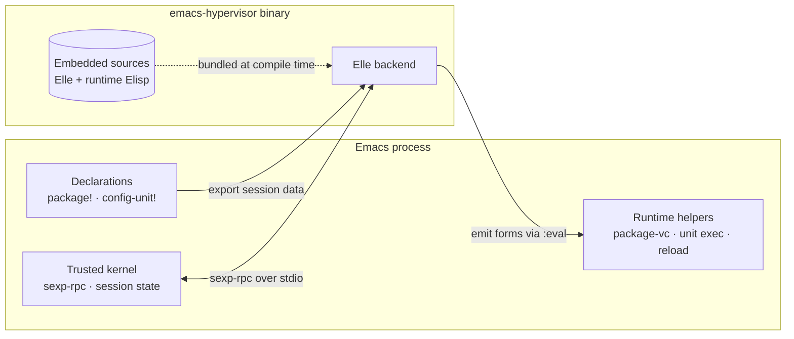
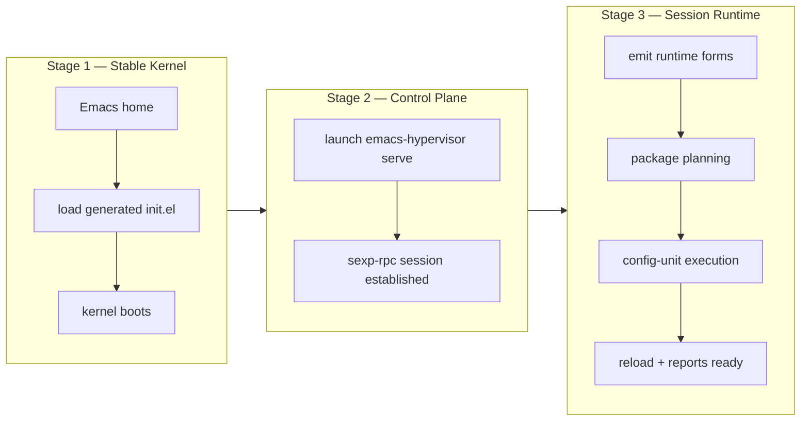

# Architecture

**Attention Conservation Notice.** For technically curious users and contributors.
Skip if you only need to use Hypervisor day-to-day — the [README](../README.md)
covers usage and features.

## How It Works

Three properties make this architecture distinctive:

**Deterministic startup as a dependency graph.** Hypervisor grew out of
[`emacs-backbone`](https://github.com/nohzafk/emacs-backbone), which proved
that topological sorting and explicit dependencies eliminate non-determinism in
Emacs config. Hypervisor takes the idea further: startup becomes an observable
orchestration session with preflight validation, failure propagation, execution
plans, and reports.

**Lisp-to-Lisp homoiconicity.** Because Elle is a Lisp, config-unit bodies
travel between Hypervisor and Emacs as structured Lisp data, not opaque strings.
Hypervisor can inspect those Elisp forms and route supported effect sites
through semantically equivalent runtime operations. This is what powers
effect-aware reload: supported hooks, advice, and keybinding calls are
rewritten into effect-registry operations, then the registry's concrete runtime
records are used to retract old effects before re-applying a unit — all
without string parsing.

**Single binary, zero framework overhead.** Traditional Emacs config frameworks
require cloning a repo into `~/.config/emacs` because Emacs must load an
`init.el` written in Elisp. Hypervisor compiles everything into one binary. Your
Emacs home contains only generated bootstrap files; your own config lives
cleanly in the Hypervisor config directory.

## Architecture Overview

One rule: **Emacs keeps a small trusted kernel; Elle owns orchestration
policy.**



| Layer | Lifetime | Owns |
|---|---|---|
| **Emacs kernel** | Resident, small | Process startup, session state, sexp-rpc dispatch, `package!` / `config-unit!` macros, trusted `:eval` surface |
| **Elle backend** | Runs in binary | Startup dependency graphs, startup preflight checks, boot policy, execution ordering, failure propagation, reports |
| **Runtime forms** | Transient, per session | package.el/package-vc bridge, unit execution substrate, live reload policy, report rendering |

Startup and reload intentionally have different policy owners. Elle owns the
startup control plane because the session-scoped subprocess is alive while
packages and initial config units are planned and executed. Soft reload happens
after that subprocess has exited, so the Emacs-resident runtime owns live reload:
it reloads declarations, diffs units, checks reload-time env/executable/feature
requirements, cleans registry effects, applies changed units, and reports the
result. Shared data shapes keep the two paths aligned, but reload is not merely
an eval helper.

## Three-Stage Bootstrap



**Stage 1 — Stable kernel.** The generated `init.el` contains the trusted
Emacs kernel: process startup, session state, sexp-rpc parsing, request
dispatch, and the small eval surface used by the host.

**Stage 2 — Control plane.** Emacs launches `emacs-hypervisor serve`, then
Emacs and Elle exchange request, response, and event messages over stdio using
S-expressions.

**Stage 3 — Session runtime.** The binary embeds Elle source and runtime
Elisp forms; Elle sends them into Emacs for the current session, then runs
package planning, config-unit execution, reload support, reports, and shutdown.

## Lisp-to-Lisp Data Flow

The key invariant: **protocol metadata and code data are decoded with different
rules.** Protocol fields become normal Elle data for graph and planning code.
Config-unit `:body` fields remain raw Lisp code — Elle never recursively
converts plist-like lists inside a body, because `(foo (:a 1 :b 2))` is
code/data, not a protocol plist.

The path through the system:

1. `config-unit!` captures the body as `(progn ... t)`.
2. Emacs canonicalizes reader-hostile forms while preserving semantics.
3. Supported hook, advice, and keybinding sites are normalized into
   effect-registry helper calls.
4. Emacs sends session data through sexp-rpc.
5. Elle decodes package, unit, and env metadata; each unit `:body` stays raw
   Lisp code rather than becoming protocol data.
6. Elle emits `(emacs-hypervisor-runtime-run-unit NAME 'BODY 'REQUIRES)`.
7. Emacs evaluates the structured body directly; registry helpers install and
   record supported runtime effects.

This homoiconic surface is what makes structural inspection, targeted rewrites,
effect-aware reload, and interactive remediation practical without re-parsing
opaque strings.

## Homoiconicity Implementation

`config-unit!` bodies cross the Elle/Emacs boundary as structured Lisp data,
not as printed strings. Emacs exports bodies as Elisp forms, serializes them
as readable s-expressions, Elle reads them as data, and sends them back to
Emacs as quoted forms for direct `eval`.

### Semantic Model

| Term | Meaning |
|---|---|
| Structured body | A config-unit `:body` stored as an Elisp form such as `(progn ... t)`, not as a printed string. |
| Wire s-expression | One textual s-expression line sent over stdio by `sexp-rpc`; the text is transport, but the payload model is Lisp data. |
| Elle array | Elle's representation for Emacs vector syntax read from `[...]`; printed recursively by `protocol:sexp-string`. |
| Reader-hostile symbol | Elisp syntax that Elle cannot currently read, especially bare `1+` and `1-` symbols. |
| Canonicalization | Emacs-side rewrite that turns safe hostile call forms like `(1+ x)` into `(+ x 1)` before export. |

### Invariants

1. `elle/protocol.lisp` and repo-owned Elisp runtime forms are in scope; the
   Elle compiler/Rust reader is not modified for this feature.
2. `config-unit!` bodies are not stringified for normal execution.
3. Emacs vectors in config bodies preserve string elements on the wire,
   including keys like `"["` and `"]"` used by `transient`.
4. `#'` and `'` reader shortcuts are not emitted by the Emacs serializer,
   because Elle's reader does not accept them.
5. `1+` and `1-` are rewritten only in call position. Bare occurrences fail
   loudly rather than silently changing meaning.
6. Runtime execution `eval`s structured forms directly, not `(read body)`.

### Code Anchors

| Component | Location |
|---|---|
| Recursive array printing in Elle protocol | `elle/protocol.lisp` (`sexp-string`) |
| Recursive array traversal in `from-wire` / `to-wire` | `elle/protocol.lisp` |
| Structured config-unit body export | `elle/runtime-forms/emacs-hypervisor-declarations.el` |
| Canonicalize `1+` / `1-` call forms | `elle/runtime-forms/emacs-hypervisor-declarations.el` |
| Direct runtime eval of structured bodies | `elle/runtime-forms/emacs-hypervisor-unit-runtime.el`, `elle/runtime-forms/emacs-hypervisor-compose.el` |
| Quote bodies/requires in Elle-emitted run-unit forms | `elle/execution.lisp` |
| Avoid Emacs reader shortcuts on outbound messages | `host/templates/lisp/emacs-hypervisor-sexp-rpc.el` |

### Limitations

- Elle reader compatibility is scoped to observed blockers: vectors,
  quote/function shortcuts, and `1+`/`1-`. Additional reader-hostile Elisp
  syntax may appear as more bodies cross as data.
- `1+`/`1-` canonicalization is Emacs-side; broader Elle reader support may
  replace it later.

## Extensions

**Extension** has one precise meaning in Hypervisor: *a native plugin loaded
into the Elle runtime through the stable plugin ABI* (the `elle-plugin` crate),
together with the thin Elle actor and Elisp surface that integrate that plugin
into a session. The stable-ABI native plugin is the defining element — a feature
that ships no such plugin is **not** an extension, regardless of how it renders
or where its state lives.

The canonical extension is **Mermaid**: the `mmdflux` `cdylib` is loaded via
`(import spec)`, an Elle actor dispatches `:render` calls to it, and an Elisp
surface displays the result. See
[architecture-mermaid.md](architecture-mermaid.md).

Extensions reuse shared infrastructure — the `run-extension-actor` loop, the
sexp-rpc mailbox, and the `dispatch-extension-call` table — but reusing that
infrastructure does not by itself make a feature an extension. Loading a
stable-ABI plugin does.

## File Guide

```text
emacs-hypervisor/
├── host/                              # Rust native host
│   ├── src/main.rs                    # CLI entrypoint (init, env, serve)
│   ├── build.rs                       # embeds Elle source + Elisp at compile time
│   ├── emacs-kernel/                  # trusted Emacs kernel (bundled into init.el)
│   │   ├── home-startup.el            #   home bootstrap wrapper
│   │   ├── emacs-hypervisor-bootstrap.el    #   process startup, sexp-rpc, eval surface
│   │   ├── emacs-hypervisor-session-state.el#   session state management
│   │   └── emacs-hypervisor-sexp-rpc.el     #   S-expression wire protocol
│   └── elisp_pack/                    # build-time Elisp packer (Rust crate)
│       └── src/lib.rs
│
├── elle/                              # Elle backend (embedded in binary)
│   ├── hypervisor.lisp                # backend entrypoint
│   ├── protocol.lisp                  # sexp-rpc helpers, wire decoding
│   ├── graph.lisp                     # dependency graph construction
│   ├── preflight.lisp                 # preflight validation checks
│   ├── boot-policy.lisp               # boot policy decisions
│   ├── planning.lisp                  # execution plan generation
│   ├── execution.lisp                 # config-unit execution
│   ├── runtime-forms.lisp             # coordinates emitted runtime modules
│   └── runtime-forms/                 # transient Elisp emitted per session
│       ├── modules.manifest           #   single source for embedded runtime modules
│       ├── module-loader.lisp         #   module loading coordinator
│       ├── emacs-hypervisor-declarations.el       #   package!/config-unit! macros
│       ├── emacs-hypervisor-package-bridge.el      #   package.el/package-vc bridge
│       ├── emacs-hypervisor-package-runtime.el     #   package event handling
│       ├── emacs-hypervisor-unit-runtime.el        #   unit execution helpers
│       ├── emacs-hypervisor-session-base.el        #   session lifecycle
│       ├── emacs-hypervisor-selective-reload.el    #   reload diffing + scheduling
│       ├── emacs-hypervisor-config-loader.el       #   startup/reload config loading
│       ├── emacs-hypervisor-reload-policy.el       #   Emacs-resident soft reload policy
│       ├── emacs-hypervisor-reload-report.el       #   reload reports, warnings, log formatting
│       ├── emacs-hypervisor-effect-registry.el     #   generic effect records
│       ├── emacs-hypervisor-effect-aware-reload.el #   effect rewrite dispatcher + cleanup
│       ├── emacs-hypervisor-effect-kind-hook.el    #   add-hook effect kind
│       ├── emacs-hypervisor-effect-kind-advice.el  #   advice-add effect kind
│       ├── emacs-hypervisor-effect-kind-keybinding.el #   keybinding effect kind
│       ├── emacs-hypervisor-compose.el             #   wires reload into M-x command
│       ├── emacs-hypervisor-report-core.el         #   report data structures
│       └── emacs-hypervisor-report.el              #   startup report rendering
│
├── tests/
│   ├── elle/hypervisor-runtime.lisp               # Elle runtime semantics tests
│   └── elisp/emacs-hypervisor-bootstrap-test.el   # kernel + runtime helper tests
│
├── scripts/
│   ├── analyze-runtime.lisp           # compile-aware analysis source
│   └── analyze-runtime-modules        # repo-local analysis runner
│
├── config.org                         # repo test configuration
├── config/                            # repo-local support files for config.org
├── early-init.el                      # repo test early-init
└── justfile                           # build, test, and dev commands
```
